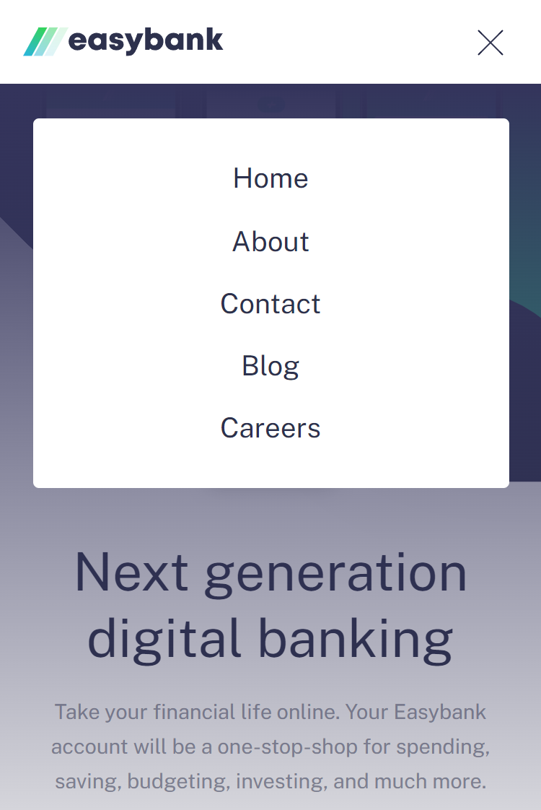
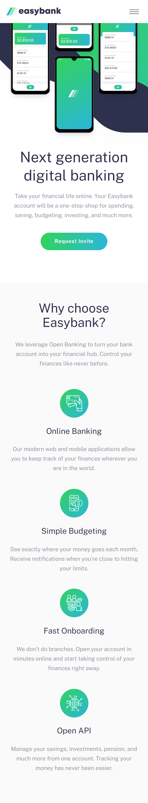

# EASYBANK LANDING PAGE
Solução para criar uma landing page.

## Índice

- [Visão geral](#visao-geral)
  - [O Desafio](#o-desafio)
  - [Screenshot](#screenshot)
- [Resultado](#resultado)
- [Minha caminhada](#minha-caminhada)
  - [Propriedades](#propriedades)
  - [O que aprendi](#o-que-aprendi)
  - [Recursos](#recursos)
- [Autor](#autor)

## Visão Geral

### O Desafio

Os usuários devem ser capazes de:

- Visualizar o tamanho dos elementos ajustados com base no tamanho da tela do dispositivo (mobile e desktop)

- Visualizar os estados de foco para todos os elementos interativos na página

### Screenshots

<html>
  <h4>Progresso atual</h4>
  
  
  <!-- 
  <h4>Layout mobile tema claro</h4>
  
  <h4>Layout desktop tema padrão</h4>
  
  <h4>Layout desktop tema claro</h4>
  
  <h1>Testando funcionalidades</h1>
   
  -->
</html>

## Resultado: [Veja como ficou!](https://easybank-landing-page-pedroalima.vercel.app/)

## Minha caminhada

1º dia
- [x] Planejamento
- [x] Preparativos em mobile first

2º dia
- [x] Barra de navegação
- [x] Seção principal

3º dia
- [x] Feature menu mobile
- [x] Seção vantagens

4º dia
- [x] Seção ultimos artigos

5º dia
- [ ] rodapé
- [ ] Layout desktop

6º dia
- [ ] Layout desktop

7º dia
- [ ] Estados de foco

### Propriedades

- Mobile-first
- Semântica HTML
- SASS
- JavaScript

### Meu aprendizado
...

Trechos de destaque:

HTML
```html
...
...
```
JavaScript
```javascript
...
...
```

### Recursos

<!-- - [JS - .addEventListener() na MDN](https://developer.mozilla.org/pt-BR/docs/Web/API/EventTarget/addEventListener) - Esse artigo vai te ajudar a entender como utilizar o método de instância. -->

- [O desafio da Frontend Mentor](https://www.frontendmentor.io/challenges/todo-app-Su1_KokOW) - Neste link você encontrará o desafio solucionado aqui.

## Autor

- LinkedIn - [Pedro A. Lima](https://www.linkedin.com/in/pedrolima626/)
