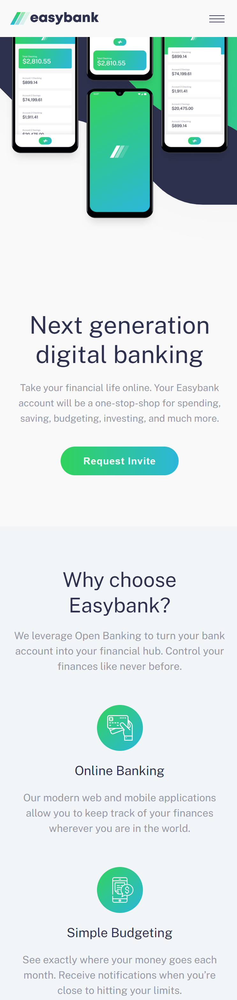
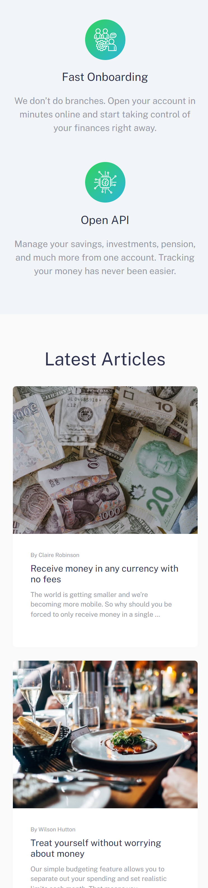
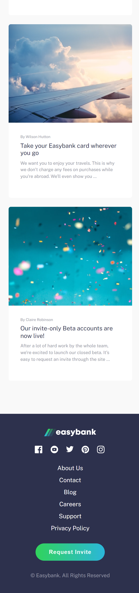
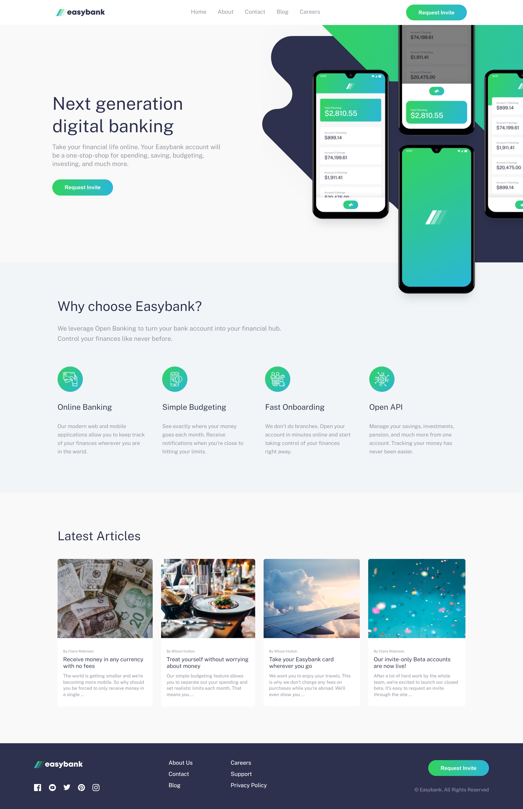

# EASYBANK LANDING PAGE
Solução para criar uma landing page.

## Índice

- [Visão geral](#visao-geral)
  - [O Desafio](#o-desafio)
  - [Screenshot](#screenshot)
- [Resultado](#resultado)
- [Minha caminhada](#minha-caminhada)
  - [Propriedades](#propriedades)
  - [O que aprendi](#o-que-aprendi)
  - [Recursos](#recursos)
- [Autor](#autor)

## Visão Geral

### O Desafio

Os usuários devem ser capazes de:

- Visualizar o tamanho dos elementos ajustados com base no tamanho da tela do dispositivo (mobile e desktop)

- Visualizar os estados de foco para todos os elementos interativos na página

### Screenshots

<html>
  <h4>Menu mobile</h4>
  
  <h4>Layout mobile</h4>
    
  <h4>Layout desktop </h4>
  
</html>

## Resultado: [Veja como ficou!](https://easybank-landing-page-pedroalima.vercel.app/)

## Minha caminhada

1º dia
- [x] Planejamento
- [x] Preparativos em mobile first

2º dia
- [x] Barra de navegação
- [x] Seção principal

3º dia
- [x] Feature menu mobile
- [x] Seção vantagens

4º dia
- [x] Seção ultimos artigos

5º dia
- [x] rodapé

6º dia
- [X] Layout desktop
  * Barra de navegação
  * Seção principal

7º dia
- [x] Layout desktop
  * Seção vantagens
  * Seção ultimos artigos
  * rodapé
- [x] Refatoração

### Propriedades

- Mobile-first
- Semântica HTML
- SASS
- JavaScript

### Meu aprendizado
O objetivo do projeto foi pôr em prática meus conhecimentos de SASS, consegui solidificar os conceitos de mixins, variáveis, nesting e seletor "&", que são essenciais para melhorar a produtividade no desenvolvimento da folha de estilo.

Trechos de destaque:

SCSS
```scss
...
// Variables
$active-status: hsl(136, 65%, 51%);

// Mixins
@mixin flexbox($display, $direction, $justify, $align) {
    display: $display;
    flex-direction: $direction;
    justify-content: $justify;
    align-items: $align;
}
...
// Utilization
&-middle {
  @include flexbox(flex, column, none, flex-start);
  flex-wrap: wrap;
  row-gap: 1rem;
  height: 12vh;
  width: 25vw;
  margin-right: 9vw;
  
  a:hover {
    color: $active-status;
  }
}
...
```

### Recursos

- [SASS - Documentation](https://sass-lang.com/documentation/) - Nesse site você saberá tudo sobre o mundo SASS.

- [O desafio da Frontend Mentor](https://www.frontendmentor.io/challenges/easybank-landing-page-WaUhkoDN) - Neste link você encontrará o desafio solucionado aqui.

## Autor

- LinkedIn - [Pedro A. Lima](https://www.linkedin.com/in/pedrolima626/)
